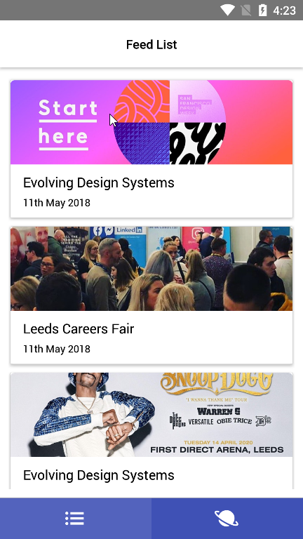
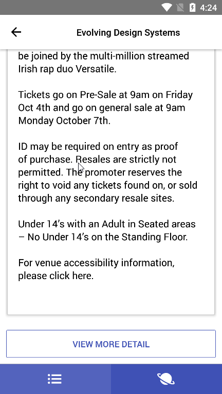

<div align="center">
  <p>thedistance Mobile Demo</p>
  <h1>React Native App</h1>
</div>

## 👋 Intro

The project is a React Native Demo for the showcase.
The project is helpful to kick-start next project, as it provides a lot of the common tools you may reach for, all ready to go.

## 🚀 Getting Started

```bash
# Install dependencies
yarn install && ( cd ios && pod install )
```

#### iOS

```bash
# Start in the iOS Simulator
npx react-native run-ios --simulator="iPhone 11"
```

#### Android

```bash
# Start in the Android Simulator
npx react-native run-android
```



